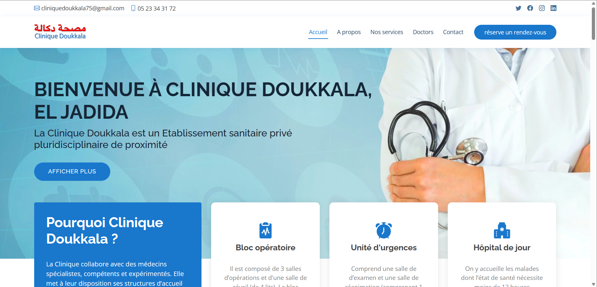

# CLINIQUE DOUKKALA RESPONSIVE TEMPLATE, HTML/ CSS/ JAVASCRIPT/ BOOSTRAP.

This responsive web template has been designed and developed for Clinique Doukkala, an esteemed private hospital in El Jadida, seamlessly blends modern design with cutting-edge functionality. Crafted using HTML5, CSS3, JavaScript, and Bootstrap, the template ensures a dynamic user experience across devices and screen sizes.

The template features an intuitive navigation system that allows patients and visitors to effortlessly access vital information such as medical services, doctor profiles, facilities, and contact details. The responsive design guarantees that the website adapts flawlessly to various devices, from large desktop monitors to smartphones, ensuring a consistent and user-friendly interface.

With thoughtful use of JavaScript, we've incorporated interactive elements to enhance user engagement. This includes dynamic forms for appointment scheduling and inquiries, ensuring a convenient way for patients to reach out to the hospital. Smooth animations and transitions add an extra layer of sophistication, contributing to an enjoyable browsing experience.

## Tech Stack

       

## Screenshot of the website :

## 🌐 Socials:
 
 
 
 

## Author

[@ElazzouziHassan](https://github.com/ElazzouziHassan)

## Support

For support, email ezhassan.info@gmail.com 